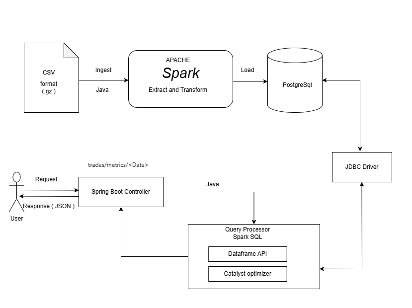

# TRADE AND ORDER ANALYTICS API
This project is created for analyzing market trade and order for each day.

# Description
The application allow companies to ingest their daily trade order data and get insights on the data.
Through API, application will produce aggregates in JSON format for each date and instrument, such as,
1. Total trades count per instrument.
2. Total traded volume per instrument.
3. Number of unique accounts that traded each instrument.
4. Top 5 instruments by notional value for the day.
5. Order Lifecycle: how many orders were entered vs. how many got cancelled or turned into TRADE, etc.
6. Fill Ratio: For each account what fraction of their orders of the original displayed quantity is actually filled.

## Application Architecture



# Minimal setup for the application

For building and running the application you need:

- [JDK 17 ](https://jdk.java.net/archive/)
- [PostgreSQL](https://www.postgresql.org/download/)
- [Maven 3 ](https://maven.apache.org)


## Database: `financial_tracking_analytics`
Create a PostgreSQL database with the name `financial_tracking_analytics`.
## Create Tables manually
For creating the tables, go to the `dbscript` folder inside the project folder and execute the `schema.sql` file against the database `financial_tracking_analytics`

## Configure Datasource, JPA, Hibernate
Under `src/main/resources` folder, open `application.yml` and edit the below database properties with your local database properties.

```
spring.datasource.url= url: jdbc:postgresql://localhost:5432/financial_tracking_analytics
spring.datasource.username= postgres
spring.datasource.password= admin
```
## CSV file location

In the application.yml file, the location of the csv file is specified.
```
data:
  import:
    location: C:\\Users\\Documents\\analytics\\data
  archive:
    location: C:\\Users\\Documents\\analytics\\archive
```
Please edit the location of the csv file and archive folder with your local folder.
Application will not process the file if it is not in the specified location.

## Installation
The project is created with Maven, so you just need to import it to your IDE and build the project to resolve the dependencies.

## Running the application locally

There are several ways to run this application on your local machine.

One way is to execute the `main` method in the `com.financial.analytics.GlobalTradeOrderAnalyticsApplication` class from your IDE.

or

Open your command prompt and run the project by using the command : `mvn clean spring-boot:run -Dspring-boot.run.jvmArguments="--add-exports=java.base/sun.nio.ch=ALL-UNNAMED 
--add-exports=java.base/sun.security.action=ALL-UNNAMED --add-opens=java.base/java.io=ALL-UNNAMED --add-opens java.base/sun.util.calendar=ALL-UNNAMED"
`
The below JVM arguments are necessary to run the application because apache spark using some legacy classes 
for run/processing the data.

If you are using IntelliJ IDEA / Eclipse , before running the application please add the below JVM arguments
in the run configuration of the application.

```
--add-exports=java.base/sun.nio.ch=ALL-UNNAMED
--add-exports=java.base/sun.security.action=ALL-UNNAMED
--add-opens=java.base/java.io=ALL-UNNAMED
--add-opens java.base/sun.util.calendar=ALL-UNNAMED
```
The application will start on port 8090 with context path `/myfin/api`.

## API Endpoints
The application provides the following API endpoints:
1. GET http://localhost:8090/myfin/api/process-and-archive ( api to process the file and archive the file)
2. GET http://localhost:8090/myfin/api/trades/metrics/2018-05-28 ( here date is mandatory and user can edit the date)

You can use any REST client (eg. Postman) to test the endpoints.

## API documentation using Swagger

TBD

